# Student Attendance Manager

An Attendance Management System through which students can view their attendance details and faculties can mark and maintain attendance records of students.

## Screenshots

### Entity Relationship Diagram

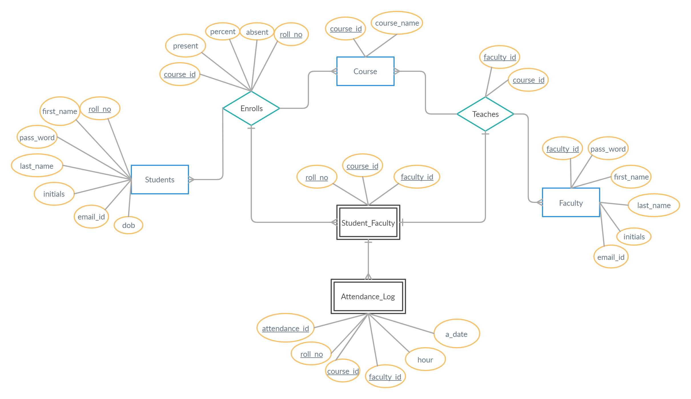

### Relational Schema

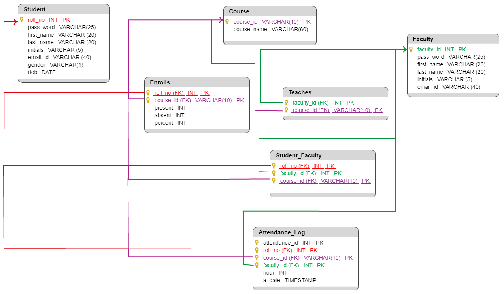

| Landing Page  
| ---------------------------
| 

 

### Student Section

| Login | Homepage |
:-------------------------:|:-------------------------:
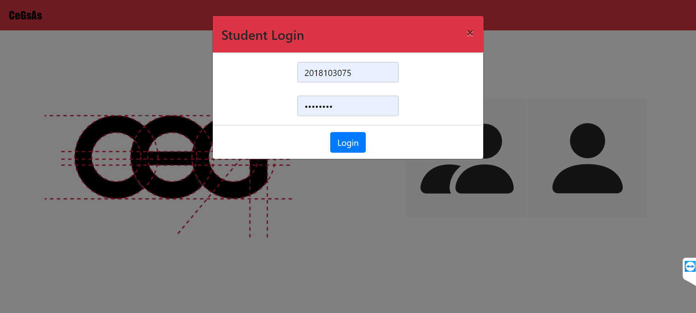 | 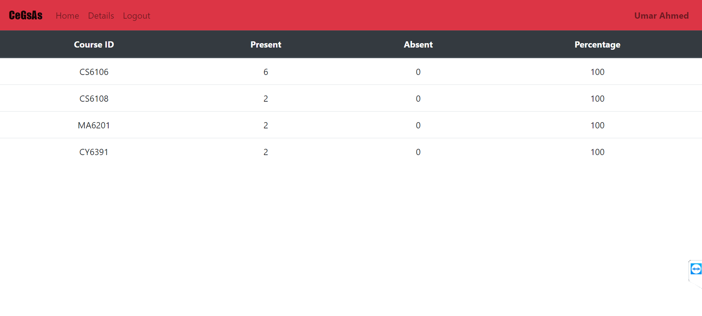

| Details | Bunk Details |
:-------------------------:|:-------------------------:
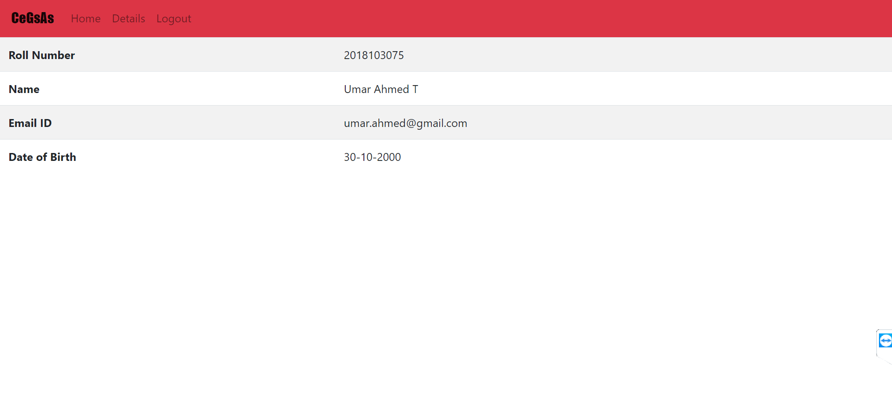 | 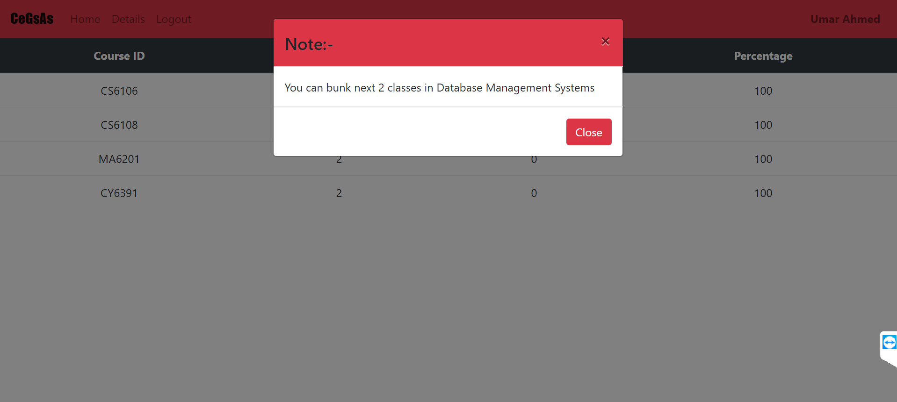

 

### Faculty Section

| Login | Homepage |
:-------------------------:|:-------------------------:
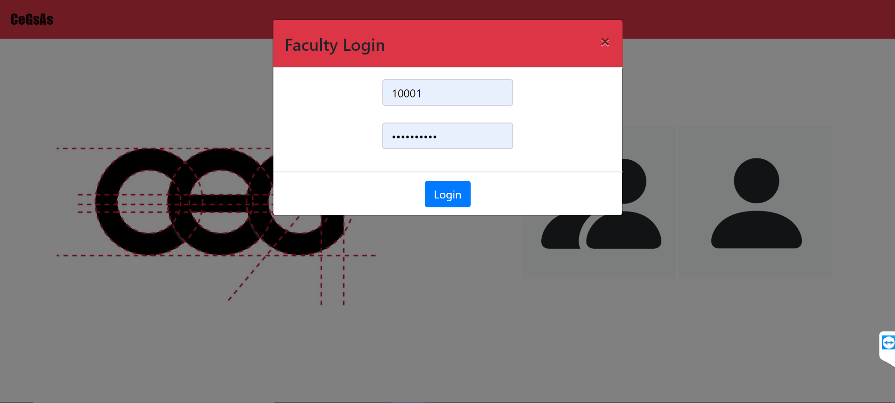 | 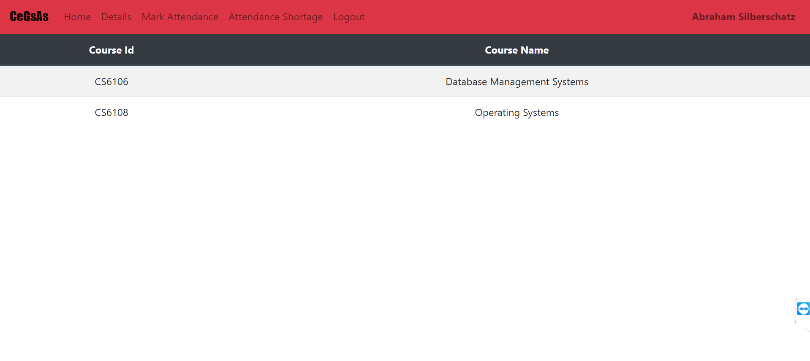

| Details | Attendance Shortage |
:-------------------------:|:-------------------------:
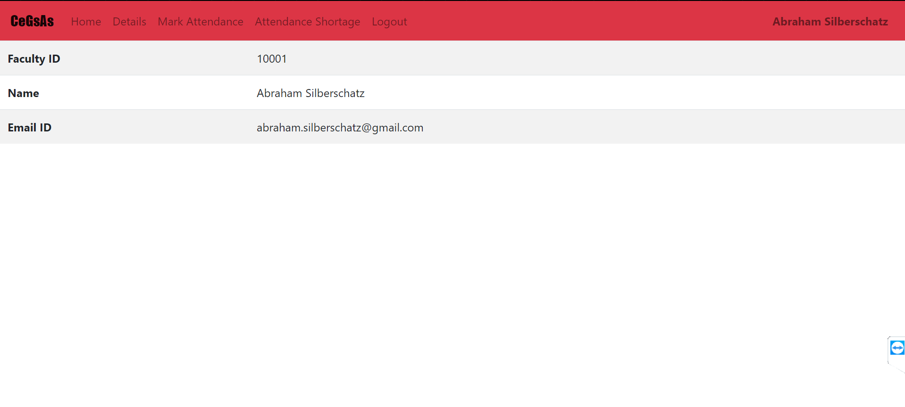 | 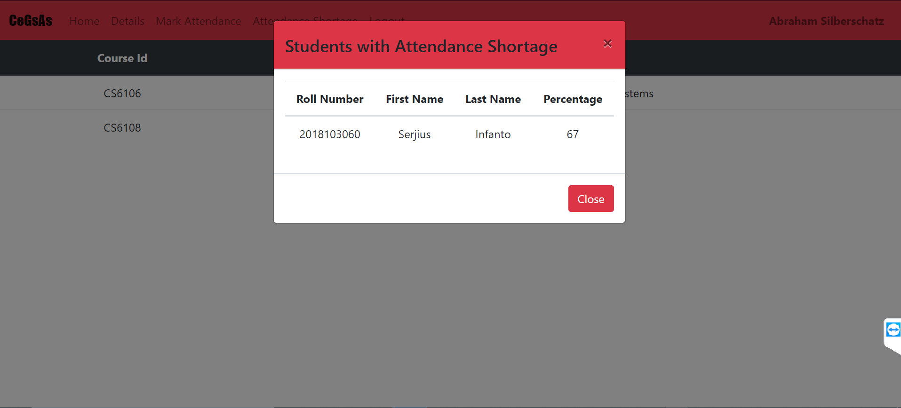

| Choose Subject | Mark Attendance |
:-------------------------:|:-------------------------:
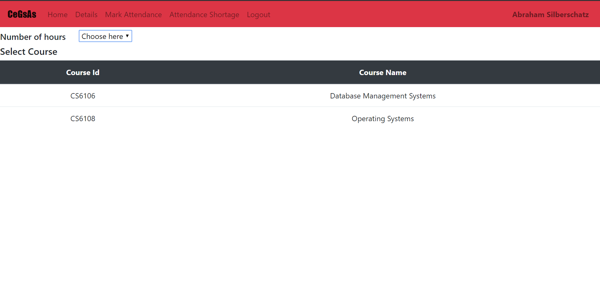 | 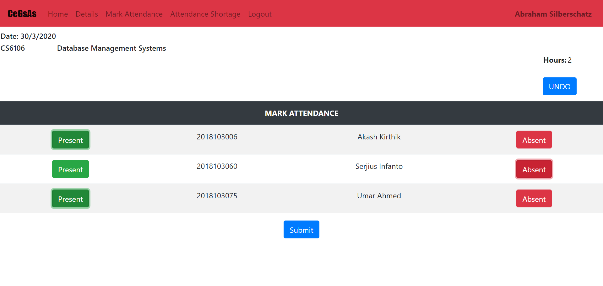
